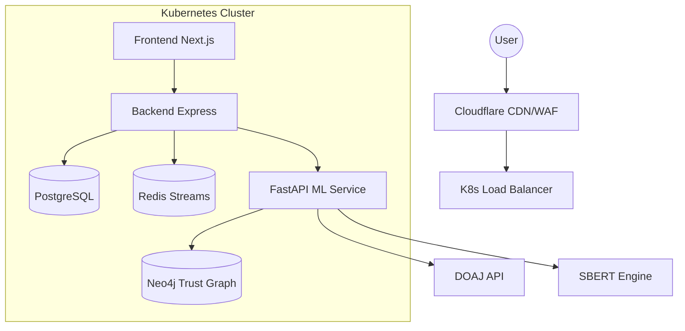

# System Architecture — SmartResearch

## High-Level Overview

## Service Definitions

### 1. Frontend (Next.js)
- **Role:** Interactive UI, client-side state management (Zustand).
- **Hardening:** Static Generation for Dashboard, server-side auth checks.

### 2. Backend (Express)
- **Role:** Business logic, API gateway, security enforcement.
- **Hardening:** Global auth middleware, server-side TrustRank validation.

### 3. ML Service (FastAPI)
- **Role:** Heavy computation, SBERT matching, Trust graph traversal.
- **Scaling:** Horizontal Pod Autoscaler (HPA) configured for 2-10 replicas.

### 4. Data Layer
- **PostgreSQL:** Persistent user and research data.
- **Redis:** Real-time feed buffering and caching.
- **Neo4j:** Reputation relationships and citation paths.
