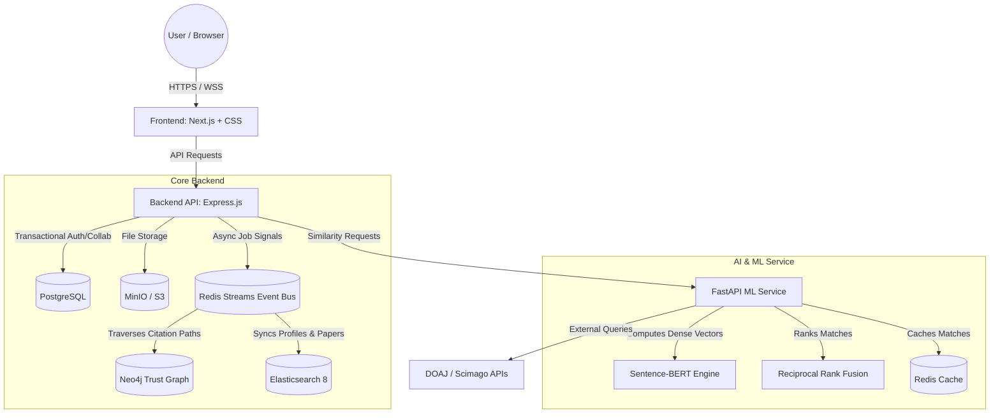

# ResearchBridge: Comprehensive Project Status & Gap Analysis Report
**Institution:** Institute of Information Technology (IIT), University of Dhaka  
**Student:** Mostofa Aminur Rashid (Roll: 2506107)  
**Supervisor:** Dr. Kazi Muheymin-Us-Sakib  

---

## 📋 Executive Summary
**ResearchBridge** is a highly ambitious, multi-service platform built for a solo developer project. It relies on a high-performance **"Triple-Store" database sync architecture** (PostgreSQL primary synced to Elasticsearch and Neo4j via a Redis Streams event bus) to enable advanced semantic discovery, trust scoring, and real-time collaboration.

A deep-dive recheck across all frontend, backend, testing, and ML codebase folders confirms that this is a highly mature project. The architecture strictly adheres to "Domain integrity, no scattered config." 

- **Core Infrastructure & Backend APIs** are roughly **95% complete**. Databases, ML matching, MinIO storage, search, WebSockets, event buses, and core CRUD services are fully implemented and running locally via Docker Compose.
- **Frontend Next.js Pages** are roughly **85% complete** with premium styling, local storage caching, and virtualized lists (e.g., Virtuoso in the Library module).
- **Real-Time Integration & Feature Completion** are roughly **60% complete**. Key gaps remain in wiring up the collaborative editor UI to the existing Yjs backend, implementing the Mentorship module, and finalizing paper reading history logic.

---

## 🏗️ System Architecture & Data Flow

---

## 🟢 Completed Work (What You Have Done)

Below is the verified list of fully implemented, functional modules found in the active codebase:

### 1. Robust Multi-Container Infrastructure
* **Containerization:** All services (`backend`, `frontend`, `ml-service`, `postgres`, `redis`, `elasticsearch`, `neo4j`, `minio`) are dockerized and run seamlessly together via `docker-compose.yml`.
* **MinIO Object Storage:** `StorageService` connects to MinIO (S3 compatible) for file and avatar uploads.
* **Sync Engine (Redis Streams):** Real-time replication bus is fully built. Workers use `XREADGROUP` to ensure updates to profiles in PostgreSQL propagate correctly to Neo4j (`graphSync.worker`) and Elasticsearch (`searchSync.worker`).

### 2. Frontend User Experience
* **The Library Module:** Highly polished UI utilizing `react-virtuoso` to render huge lists of academic journals efficiently. Supports local storage collection caching, filtering by SJR tier/Access, and exporting collections to CSV.
* **Onboarding & Blogs:** Fully wired to backend REST endpoints (`API.onboarding.questionsFlat`, `API.blogs.list`), delivering seamless user experiences with dynamic progress routing.

### 3. AI-Powered Matching & Discovery
* **Collaborative Filtering (CF):** Computes user-user similarity from PostgreSQL interactions (saved papers and votes) using sparse CSR matrices.
* **Content-Based Filtering (CBF):** Uses `Sentence-BERT` to generate dense vector embeddings from user profile text.
* **Hybrid Search Scorer:** Merges BM25 (Elasticsearch keyword search) and dense kNN vector embeddings using Reciprocal Rank Fusion (RRF).
* **TrustRank:** PageRank implementation in Neo4j GDS to calculate researcher authority scores based on citations and endorsements.

### 4. Collaboration Workspace Backend
* **Database Persisted CRDTs:** The Node.js `CollaborationService` is implemented, utilizing **Yjs** to serialize binary document state directly into PostgreSQL. 
* **State Machines:** `MilestoneService` uses state machine logic with permission boundaries (Admin vs Member) to transition statuses safely.
* **Unit Testing:** Comprehensive Jest test suites cover the `CollaborationService`, `MilestoneService`, and `ProjectService` mimicking Database rollbacks on failure.

---

## 🟡 Gaps & Outstanding Work (What Needs to be Worked On)

These are the features that are either mocked, stubbed, or missing, grouped by priority for your Master's project defense:

### 🔴 High Priority: Core Feature Integration (Required for Demo)
- [ ] **WS/Yjs Connection in Editor UI:**
  * *Current State:* The collaborative editor UI (`collaborative-editor.tsx`) is a mock textarea with static text.
  * *Required:* Integrate `@hocuspocus/provider` or a standard `y-websocket` client inside React to establish real-time sync with your existing Node.js websocket gateway. **This will be the crown jewel of your live demo.**
- [ ] **Workspace Kanban Dashboard Integration:**
  * *Current State:* The Kanban Board (`kanban-board.tsx`) and workspace pages use hardcoded placeholder data.
  * *Required:* Query the `ProjectService` API endpoints to display active user projects, fetch board tasks, and update milestone states dynamically on the frontend.
- [ ] **Checklist & Templates Storage:**
  * *Current State:* The template URLs (e.g., `/templates/ieee.docx`) return 404 errors as the files do not exist.
  * *Required:* Create a `templates` directory in `frontend/public/` and seed it with dummy LaTeX/Word template documents.

### 🟡 Medium Priority: Missing Features from Proposal
- [ ] **Mentorship Module:**
  * *Current State:* The proposal lists "Mentorship slot creation, CF+CB pairing, session tracking." There are no DB tables or API controllers for mentorship booking in the backend yet.
  * *Required:* Create a `mentorships` schema/table, write Express handlers, and build a simple request booking UI in the frontend. 
- [ ] **Paper Tracking & Reading History:**
  * *Current State:* The "Papers Read" count on the user dashboard is hardcoded as `0`.
  * *Required:* Add a user reading history/log table to track user bookmarks/downloads, and expose a route for the dashboard.

### 🟢 Low Priority: Hardening & Calibration (For final stages)
- [ ] **WebSocket Security Hardening:** Inject JWT authentication middleware into the Socket.IO server to restrict real-time rooms to authorized project members only.
- [ ] **SBERT Threshold Calibration:** Refine recommendation score cutoff bounds in your FastAPI ML service with realistic sample research datasets to ensure relevant collaboration matches.

---

## 📅 Timeline Alignment (22-Week Gantt Reconciliation)

Based on the Gantt chart from your `ResearchBridge Project Proposal.pdf`, here is where you stand:

| Week | Module / Task | Codebase Status | Work Remaining |
|:---:|---|:---:|---|
| **1-2** | User Auth & Profile | **100% Done** | None. Database, API, and UI auth flow are fully completed. |
| **3-5** | Matching Engine (CBF/CF/SBERT) | **100% Done** | ML FastAPI code is complete and integrated. |
| **6-7** | Collaboration Workspace & Sync | **70% Done** | **Required:** Connect React text editor and Kanban Board to their existing backend APIs. |
| **8** | Knowledge Library (Uploads/PDFs) | **95% Done** | Excellent UI implementation. Just missing physical file downloads. |
| **9-10** | Community Forum & TrustRank | **100% Done** | Neo4j PageRank and Express posts API are complete. |
| **11** | Mentorship Module | **0% Done** | **Required:** Build simple mentorship database tables, pairing controller, and UI. |
| **12-13** | Publication Assistant & Feedback | **70% Done** | DOAJ search is integrated. **Required:** Link template downloads. |
| **14** | Notification System | **60% Done** | Redis Streams handles triggers. **Required:** Link live UI alert toasts to websockets. |
| **15** | Researcher Profile Dashboard | **95% Done** | Dynamic profile dashboard is fully built. |
| **16-17** | Admin Dashboard & Analytics | **90% Done** | Admin routes and moderation queries exist in PostgreSQL. |
| **18-22** | Hardening, Testing & CI/CD | **85% Done** | GitHub Actions (`ci.yml`), tests, and Docker setup are solid. |

---

## 💡 Strategic Recommendations for a Solo Developer

Since this is a Master's project, you need to maximize your defense/demo impact while optimizing your coding time:

1. **Focus on the "Wow" Live Demo (Weeks 6-7 Integration):**  
   The most impressive part of a thesis presentation is **live, real-time collaboration**. Your backend already handles Yjs binary state in PostgreSQL. Prioritize wiring the React text editor and Kanban Board to the WebSocket. This visually proves your architecture.
2. **Handle the Mentorship Module Pragmatically:**  
   Instead of over-engineering complex scheduling calendars, implement a simple "Request Mentorship" form that creates a pending relationship row in your database, triggers a notification, and maps them in the Neo4j `MENTORS` graph.
3. **Use Mock Assets for Templates:**  
   Don't spend days writing LaTeX templates. Download official template files from IEEE/Nature (or create simple dummy files), rename them, and put them in `frontend/public/templates/` to resolve the 404 gap instantly.
